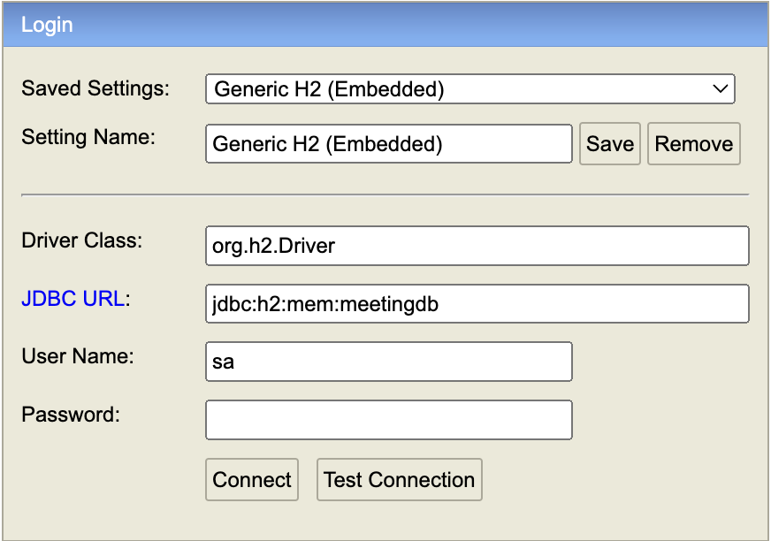

<h1>Meeting Planner</h1>

<h2>Fonctionnalités Principales</h2>
<ul>
    <li><strong>Réservation des Salles :</strong> Les utilisateurs peuvent réserver l'une des 4 salles disponibles pour des créneaux d'1 heure, entre 8h et 20h en semaine.</li>
    <li><strong>Types de Réunion :</strong> Le système prend en compte 4 types de réunion - visioconférences, séances de partage, réunions simples et réunions couplées - chacun ayant des exigences spécifiques en termes d'équipement.</li>
    <li><strong>Gestion des Équipements :</strong> Les salles sont équipées selon les besoins des réunions, allant des écrans aux pieuvres et aux webcams, garantissant ainsi que chaque réunion dispose des outils appropriés.</li>
    <li><strong>Nettoyage et Désinfection :</strong> Les salles doivent rester libres 1 heure avant la prochaine réservation pour permettre aux agents de nettoyage de désinfecter les locaux.</li>
    <li><strong>Capacité Réduite :</strong> En raison des mesures de distanciation sociale, chaque salle ne peut être occupée qu'à 70% de sa capacité initiale.</li>
</ul>
<h2>Types de Réunion et Équipement Requis</h2>
<ul>
    <li><strong>Visioconférences (VC) :</strong> Nécessitent un écran, une pieuvre et une webcam.</li>
    <li><strong>Séances de Partage (SPEC) :</strong> Nécessitent uniquement un tableau.</li>
    <li><strong>Réunions Simples (RS) :</strong> Requiert une salle d'une capacité minimale de 3 places.</li>
    <li><strong>Réunions Couplées (RC) :</strong> Nécessitent un tableau, un écran et une pieuvre, adaptées pour les réunions hybrides en télétravail et sur site.</li>
</ul>
<h2>Database</h2>

La base de données utilisée dans ce projet est une base de données H2 en mémoire. Pour y accéder après avoir exécuté l'application, veuillez suivre ce lien : <a>http://localhost:8080/h2-console </a>et changer l'URL comme l'image ci-dessous

<h2>Tests</h2>
<ul>
    <li><strong>API: </strong>Pour tester les API essentielles de l'application, veuillez exécuter le fichier apiTest situé dans le dossier racine de l'application via IntelliJ IDEA.</li>
    <li><strong>Tests Unitaires: </strong>Pour les tests unitaires, veulliez exécuter les tests dans le dossier test</li>
</ul>